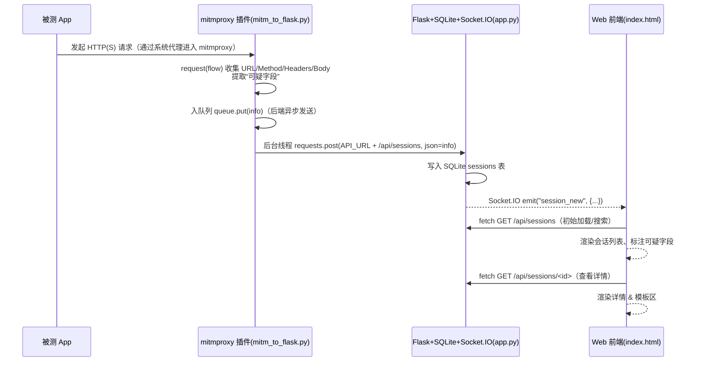
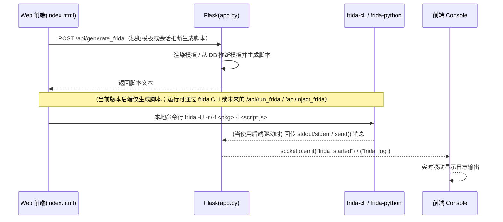
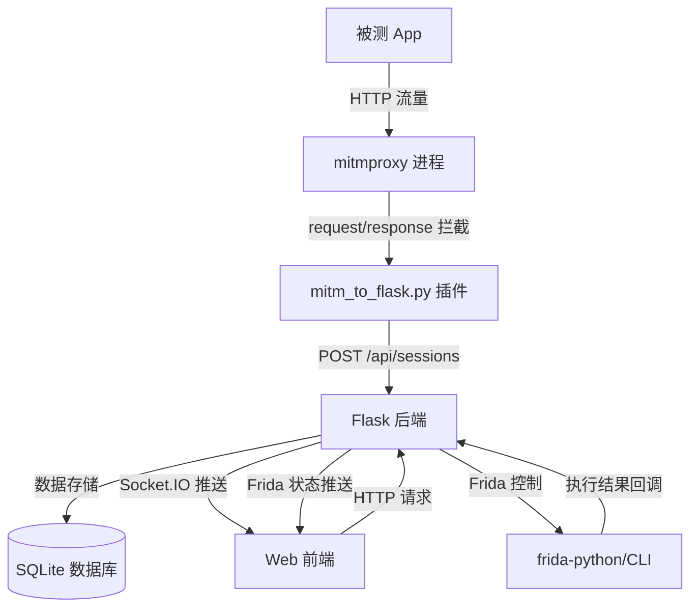

# 全链路时序图



# Frida 注入与日志回传时序图



> 说明：当前仓库版本中 **/api/generate_frida** 已实现返回脚本；`/api/run_frida` 与 `/api/inject_frida` 的“运行/注入”逻辑体现在内部 **Frida helpers**（attach/spawn + log 转发），但路由未单独暴露。详见后文“Frida 路径”段的差异说明（已用源码锚点标注）。

------

# 组件图



------

# 按文件拆分模块说明

## mitm_to_flask.py

**职责**

- 在 `request(flow)` 钩子中收集请求的 url/method/headers/body，做“可疑字段”检测；
- 将 `info` 放入队列，由后台线程批量/带重试地 POST 给 Flask `/api/sessions`。

**核心逻辑与源码锚点**

- API 地址、重试会话、后台工作线程（带退避/重试，POST `/api/sessions`）
   代码摘录：

  ```python
  API_URL = os.environ.get("API_URL", "http://127.0.0.1:5000")
  session = requests.Session()
  adapter = HTTPAdapter(max_retries=Retry(total=3, backoff_factor=0.5,
    status_forcelist=[429, 500, 502, 503, 504]))
  session.mount("http://", adapter); session.mount("https://", adapter)
  
  def _worker():
      while True:
          item = _queue.get()
          ... 
          r = session.post(API_URL + "/api/sessions", json=item, timeout=5)
  
  ```

`request(flow)` 收集并组装 `info`，入队：
 代码摘录：

```python
def request(flow: http.HTTPFlow):
    req = flow.request
    info = {
        "time": ...,
        "url": req.pretty_url,
        "method": req.method,
        "headers": dict(req.headers),
        "body": (req.get_text() if req.raw_content else "")
    }
    info["suspicious"] = detect_sensitive_from_text(...)
    _queue.put(info)

```

“可疑字段”检测逻辑（手机号/邮箱/可能的 token/base64 等）：
 代码摘录：

```python
def detect_sensitive_from_text(s: str) -> list:
    found = set()
    if PHONE_RE.search(s): found.add("手机号")
    if EMAIL_RE.search(s): found.add("邮箱")
    if BASE64_LIKE.search(s): found.add("可能的token/base64")
    ...
    return sorted(list(found))

```

**被谁调用 / 调用了谁**

- 被 mitmproxy 的生命周期钩子调用（`request(flow)`）；
- 调用了 `requests.Session.post()` 将数据推送至 Flask。

**输入输出**

- 输入：`flow.request` 中的 URL/Method/Headers/Body；
- 输出：POST `/api/sessions` 的 JSON 载荷（`time,url,method,headers,body,suspicious`）。

**错误处理 & 重试**

- 使用 `requests.adapters.Retry` 做 5xx/429 的自动重试，并对队列项异常捕获记录日志。

**并发/队列**

- 通过 `Queue` 解耦抓包线程与上报线程，避免阻塞 mitmproxy 主流程。

## app.py（Flask + SQLite + Socket.IO + Frida helpers）

**职责**

- 提供会话写入与查询 API；
- 通过 Socket.IO 将新会话/Frida 日志实时推送到前端；
- Frida 模板加载/渲染（生成脚本），并提供探测接口 `probe`。

**核心端点与实现（含字段）**

- **POST `/api/sessions`**：写 SQLite，发 `session_new`
   代码摘录：

  ```python
  conn.execute("INSERT INTO sessions VALUES(?,?,?,?,?,?,?)", (...))
  socketio.emit("session_new", {"id": sid, "time": time_str, "url": url,
                                "method": method, "suspicious": suspicious_final})
  return jsonify({"id": sid}), 201
  
  ```

**GET `/api/sessions`**：返回 `[{id,time,url,method,suspicious}, ...]`

**GET `/api/sessions/<sid>`**：返回单条 `id,time,url,method,headers,body,suspicious`

**POST `/api/clear_sessions`**（需可选 ADMIN_TOKEN）：清空并发 `sessions_cleared`

**GET `/api/sessions/export`**（`format=json/csv`）：导出会话

**Frida 模板相关**

- `GET /api/frida/templates`：列出模板及 `required_params/defaults`

- `GET /api/frida_template/<name>`：取模板源码

**POST `/api/generate_frida`**：按模板或会话生成脚本文本（不直接运行）

- 按模板：`{"template": "ssl_pinning_bypass", "template_params": {...}}` → 返回脚本
- 按会话：`{"id": "<session_id>"}` → 根据会话推断模板并返回脚本

**Probe**

- `POST /api/probe`：调用 `frida-ps -Uai` 并过滤匹配到的进程

**Frida helpers（attach/spawn + 日志透传）**

- 若通过后端驱动运行（未来的 `/api/run_frida` / `/api/inject_frida` 或内部调用），**日志通过 Socket.IO 推流**：

  - 子进程模式（frida CLI）：启动后 `emit("frida_started")`，读取 `stdout/stderr` 持续 `emit("frida_log")`

  - frida-python 模式：`session.create_script(...).on("message", ...)` 转为 `emit("frida_log")`；成功后 `emit("frida_started")`

> **差异说明（你特别要求的“Frida 路径”）：**
>
> - 当前版本仅实现 **POST `/api/generate_frida`** 生成脚本文本（不直接运行），供前端下载或手动用 frida CLI 运行（见上文锚点）。
> - **`/api/run_frida` 与 `/api/inject_frida` 路由在此提交中未发现**；对应 attach/spawn/日志透传能力已经在 helpers 中具备，未来可直接对外封装为两个 POST 接口复用这些函数。

**被谁调用 / 调用了谁**

- 被 mitm 插件/前端 fetch 调用；
- 调用 SQLite、frida CLI 或 frida-python，并发 Socket.IO 事件。

**输入输出**

- 输入：mitm 上传的 `time,url,method,headers,body,suspicious`；
- 输出：JSON/CSV；**Socket.IO 事件**：`session_new`、`sessions_cleared`、`frida_started`、`frida_log`。

**错误处理**

- API 层普遍 `try/except`，返回 `4xx/5xx`（如模板渲染/DB/Probe 错误）；

- Frida 相关对 `TransportError`/一般异常分别记录并通过 `frida_log` 告知前端

**并发/队列**

- Socket.IO 以 `threading` 模式运行，后端在读取 frida 子进程输出时用 `start_background_task` 并行推流

## index.html（前端）

**职责**

- 订阅 Socket.IO 事件（`session_new`/`frida_log`/`frida_started`）；
- 调用后端 API 拉取会话列表与详情；
- 提供模板选择、脚本编辑（当前版本按钮占位，未直接 POST 运行）。

**Socket.IO 监听**

- 连接生命周期 + 三个核心事件：
   代码摘录：

  ```js
  socket.on("frida_started", info => { appendToBuffer(`... pid=${info.pid} script=${info.script}`); });
  socket.on("frida_log", msg => { const line = msg.line || JSON.stringify(msg); appendToBuffer(line, sid); ... });
  socket.on("session_new", data => { appendToBuffer("[socket] session_new: "+...); loadSessions(...); });
  
  ```

**fetch 调用**

- **GET `/api/sessions`**（支持搜索 q）：

  ```js
  const url = q ? `${API_BASE}/sessions?q=${encodeURIComponent(q)}` : `${API_BASE}/sessions`;
  const res = await fetch(url, {cache: "no-store"});
  
  ```

**GET `/api/sessions/<id>`**（查看详情）：

```js
const res = await fetch(`${API_BASE}/sessions/${id}`);
const session = await res.json();

```

**POST `/api/clear_sessions`**：带可选 `X-ADMIN-TOKEN`

```js
await fetch(`${API_BASE}/clear_sessions`, { method:"POST", headers });

```

**你要求的“POST /api/generate_frida / /api/inject_frida / /api/run_frida”前端 fetch：**
 当前 index.html 中虽有 **“生成脚本/运行/模板执行/Probe”** 的按钮与输入区域（`#generateFridaBtn`, `#runFridaBtn`, `#runMemBtn`, `#runProbeBtn` 等 UI），但**未检索到对上述三个接口的 fetch 绑定**；按钮位于详情面板顶部与模板区

# 端点与事件清单（方法/路径/参数/返回示例）

**HTTP APIs**

- `POST /api/sessions`
  - Body：`{"time","url","method","headers","body","suspicious":[...]}`
  - Return：`{"id":"<uuid>"}`（201）
  - 说明：写 DB，随后向前端 `emit("session_new", {...})`

```
GET /api/sessions
```

- Query：`?q=keyword&limit=200&offset=0`
- Return：`[{"id","time","url","method","suspicious":[...]}, ...]`

```
GET /api/sessions/<id>
```

- Return：`{"id","time","url","method","headers":{},"body":"...","suspicious":[...]}`

`POST /api/clear_sessions`（可选需要 `X-ADMIN-TOKEN`）

- Return：`{"status":"ok","msg":"all sessions cleared"}`

```
GET /api/sessions/export?format=json|csv
```

- Return：JSON 或 CSV 下载

```
GET /api/frida/templates
```

- Return：`[{"name","display_name","required_params","targets","risks","defaults"}, ...]`

```
GET /api/frida_template/<name>
```

- Return：脚本源码文本

```
POST /api/generate_frida
```

- Body（两种模式）：
  - `{"template":"ssl_pinning_bypass","template_params":{...}}`
  - `{"id":"<session_id>"}`
- Return：脚本文本（200）；异常时 `{"error":...}`

```
POST /api/probe
```

- Body：`{"app":"com.example.app"}`
- Return：`{"found":true/false,"matches":[...],...}`

**未发现**：`POST /api/run_frida`、`POST /api/inject_frida`（当前提交）。运行与注入所需的 attach/spawn 与日志转发逻辑在 helpers 中已实现，可直接对外暴露

**Socket.IO 事件**

- `session_new`：源自后端 add_session（payload：`{"id","time","url","method","suspicious":[...]}`）；前端收到后刷新列表

`sessions_cleared`：清空会话后广播

`frida_started`：后端启动 frida（CLI 或 Python）后推送

`frida_log`：frida stdout/stderr 或 `send()` 消息统一转文本行推送

# mitmproxy 抓包为何能成功”要点

- **证书前置条件**：移动端/模拟器需设置代理，并安装 mitm 证书 `http://mitm.it`（项目文档明确列出步骤，包含代理与证书安装说明） 
- **request 钩子时机**：mitm 的 `request(flow)` 在请求转发给上游前触发，可完整拿到 URL/Method/Headers/Body（见 `request(flow)` 组装 info）
- **队列/重试**：插件侧以队列＋ `requests.Session` 的 Retry 机制稳态上报，避免阻塞代理主线程
- **后端入库与推送**：Flask 接收后写入 SQLite，并 `emit("session_new")` 推送前端
- **前端监听与渲染**：index.html 监听 `session_new` 并调用 `loadSessions()` 刷新 UI

# Frida 路径（模板推断/渲染 与 运行/注入）

- **/api/generate_frida**（已实现）：
  - 通过模板名 + 参数 或 会话 id 推断模板 → 返回脚本文本
- **/api/run_frida / /api/inject_frida**（你要求说明的路径）：
  - **当前提交未提供对应路由**；但 “attach/spawn + script.load + 日志转发” 已在 helpers 中完备：
    - CLI 子进程：`frida -U/-f ... -l script.js` 启动后推送 `frida_started`，并将 stdout/stderr 转 `frida_log`
    - Python attach/spawn：`device.attach(...)` + `script.on("message", ...)` → `frida_log`，成功后 `frida_started`（
  - 因此可轻松封装两个 POST 接口调用这两套 helper，实现“后端一键运行/注入 + 前端实时显示”。

# 快速验证手册（复制即用）

## 1）启动 mitmproxy 插件（示例）

```BASH
mitmdump -s mitm_to_flask.py --listen-host 0.0.0.0 -p 8080 --set stream_large_bodies=5m

```

> 然后在手机/模拟器上设置 WiFi 代理到你的主机:8080，并访问 `http://mitm.it` 安装证书（文档已写明）

## 2）启动后端

```
python app.py
```

## 3）本地造一条“假会话”，验证前端收到 `session_new`

```bash
curl -X POST http://127.0.0.1:5000/api/sessions \
  -H 'Content-Type: application/json' \
  -d '{
        "time":"2025-10-10 10:10:10",
        "url":"https://api.example.com/login",
        "method":"POST",
        "headers":{"Content-Type":"application/json"},
        "body":"{\"phone\":\"13800138000\",\"password\":\"P@ssw0rd!\"}"
      }'
```

打开前端 `http://127.0.0.1:5000`，会看到实时新增（后端写库＋ emit 的确存在）

## 4）生成并运行一个 Frida 模板

- 生成脚本（按模板名）：

```bash
curl -sS -X POST http://127.0.0.1:5000/api/generate_frida \
  -H 'Content-Type: application/json' \
  -d '{"template":"ssl_pinning_bypass","template_params":{}}' \
  > frida_out/ssl_bypass.js
```

（后端渲染模板返回脚本文本）

- 以 **frida CLI** 运行（USB 设备，attach 到 `com.example.app`）：

```
frida -U -n com.example.app -l frida_out/ssl_bypass.js
```

> 若你之后封装了 `/api/run_frida` 或 `/api/inject_frida`，即可改为前端按钮一键 POST 调用。日志推送面已由 helpers 通过 `frida_log/frida_started` 打通


# 安全与鲁棒性审计（问题点 → 改进建议）

**输入校验**

- `POST /api/sessions` 对传入结构做了类型/JSON 兼容处理，但未限制字段长度（可能导致 DB 膨胀）
- **建议**：限制 body/headers 长度，或进行压缩/截断；对 URL/Method 做白名单校验。


**认证/授权**

- 仅 `clear_sessions` 使用 `@require_token`，多数接口匿名可调用（含生成脚本、导出）

- 建议：为 `/api/sessions/export`、Frida 相关端点加 `@require_token`，并支持跨域 Token/Headers 校验。

**CORS/跨域**

- `SocketIO(app, cors_allowed_origins="*")` 放开了任意源（XSS/CSRF 风险）

​	**建议**：限制到受信任前端域名；对敏感 POST 接口增加 CSRF 防护或签名。

**越权/信息泄露**

- 导出接口可批量拿到 headers/body；敏感检测仅标注“命中类型”，未做数据脱敏

​	**建议**：默认导出做脱敏；在前端详情页对高危键（token/password）做隐藏/点开显示。

**日志与隐私**

- 服务器日志含请求细节，`server_debug.log` 可能落盘敏感内容

  **建议**：对日志做分级/脱敏；生产关闭 DEBUG/INFO 级别的 body 打印。

**QLite 并发**

- 每请求创建连接，`timeout=10` 可缓解锁竞争

​	**建议**：考虑连接池/写入队列；或迁移到更适合并发的存储（PostgreSQL）。

**异常处理**

- 多处 `try/except` 返回 500/400，但前端缺少对失败的细粒度提示

​	**建议**：统一错误响应结构（code/message/detail）；前端以 toast/红条显示。

**超时与重试**

- mitm 插件侧做了上报重试，后端无队列或限速策略。

  建议：后端对 /api/sessions增加速率限制/队列；避免瞬时洪峰压垮 DB。

**Frida 安全**

- 生成/运行脚本具备高权限操作风险。
   **建议**：对模板做白名单；为 `/api/generate_frida`、未来的运行端点增加 Token 保护与审计日志；模板元信息中已提供 targets/risks 字段，可用于前端提示确认

### 三者调用链与可视化闭环

**mitm_to_flask.py** 在 `request(flow)` 阶段拼装 info 并**后台线程** POST 到 Flask（队列＋重试）

**app.py** 的 `POST /api/sessions` 写入 SQLite 后，`socketio.emit("session_new")` 通知前端（字段如上）

**index.html** 监听 `session_new/frida_log/frida_started`，并用 `fetch` 拉取 `GET /api/sessions` / `GET /api/sessions/<id>`，完成实时展示与详情可视化

**Frida 路径**：当前后端已实现**模板渲染**的 `/api/generate_frida`，并具备运行/注入所需的 helpers（attach/spawn + log 转发）；将来补充 `/api/run_frida` / `/api/inject_frida` 两个 POST 即可“一键运行并推流到前端”